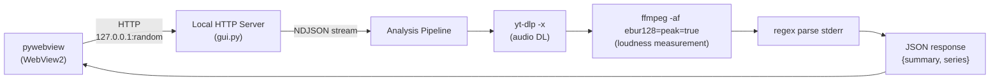

# analyze-loudness

YouTube 動画の音声ラウドネスを BS.1770 / EBU R128 準拠で分析するツール。
CLI 版と Windows GUI アプリケーション版の 2 形態を持つ。

## Architecture overview



GUI は pywebview (WebView2) + ローカル HTTP サーバーで構成。

## Project structure

```
analyze-loudness/
├── .gitignore
├── .venv/                      # Python venv (git 管理外)
├── CLAUDE.md
├── pyproject.toml              # CLI tool (pip install -e ".[dev]")
├── src/analyze_loudness/       # Python package
│   ├── __init__.py             # _subprocess_kwargs() helper
│   ├── __main__.py
│   ├── cli.py                  # argparse + main orchestration (CLI)
│   ├── gui.py                  # pywebview + local HTTP server (GUI)
│   ├── download.py             # yt-dlp download, ffprobe duration
│   ├── analysis.py             # ebur128 stderr parsing, compute_stats
│   └── plot.py                 # matplotlib figure generation (CLI only)
├── frontend/
│   ├── index.html
│   ├── main.js                 # fetch + NDJSON progress + DOM rendering + theme toggle
│   ├── theme.js                # getTheme() -- chart color provider (light/dark)
│   ├── charts/
│   │   ├── timeline.js         # uPlot wrapper (theme-aware)
│   │   ├── histogram.js        # Canvas histogram (theme-aware)
│   │   └── segments.js         # Canvas segment bars (theme-aware)
│   ├── style.css               # CSS variables + [data-theme="dark"] rules
│   └── vendor/                 # uPlot (bundled)
├── tests/                      # pytest (72 tests)
│   ├── test_analysis.py
│   ├── test_cli.py
│   ├── test_download.py
│   ├── test_gui.py
│   └── test_init.py
├── docs/
│   ├── architecture.md
│   └── security-audit.md
├── build.py                    # Build script (asset download + PyInstaller + Inno Setup)
├── analyze-loudness.spec       # PyInstaller spec
├── installer.iss               # Inno Setup script
├── THIRD_PARTY_LICENSES.txt    # Bundled license file
└── build_assets/bin/           # ffmpeg, ffprobe, yt-dlp, deno (git 管理外)
```

## CLI usage

```
python -m venv .venv
source .venv/bin/activate        # Windows: .venv\Scripts\activate
pip install -e ".[dev]"
analyze-loudness "https://www.youtube.com/watch?v=XXXXX"
analyze-loudness "https://..." --duration 10 --output-dir ./out
```

### CLI dependencies (installed via pip)

- `yt-dlp` -- pyproject.toml dependency
- `ffmpeg` / `ffprobe` -- `static-ffmpeg` package; `shutil.which` check before import
- `numpy`, `matplotlib` -- CLI only
- `pytest` -- dev dependency (`pip install -e ".[dev]"`)

## GUI usage

### Development

```
pip install -e ".[gui]"
analyze-loudness-gui
```

### Build & Distribution

```bash
python build.py              # download assets + PyInstaller bundle
python build.py --installer  # + Inno Setup installer (.exe)
python build.py --skip-download  # skip asset download
```

### GUI dependencies

- `pywebview` -- optional dependency (`pip install -e ".[gui]"`)
- `numpy` -- statistics computation
- ffmpeg, ffprobe, yt-dlp, deno -- bundled in build_assets/bin/ (PyInstaller frozen mode)

## Design decisions

### ebur128 パース方式

`ffmpeg -af ebur128=peak=true -f null -` の stderr を正規表現 `t:\s*([\d.]+)\s+TARGET.*?M:\s*([-\d.]+)\s+S:\s*([-\d.]+)` でパース。Summary ブロックは `output.rfind("Summary")` 以降から Integrated / LRA / True Peak を取得。

### メモリ制約

50 分音声を WAV デコードすると 4 GB 超で OOM になる。
生デコードは行わず、ffmpeg ebur128 の stderr テキスト出力のみを処理する。

### 無音閾値

統計計算時は Short-term > -60 LUFS のフレームのみ使用 (`SILENCE_THRESHOLD`)。無音率は S < -40 LUFS で算出。

### 中盤抽出

`(総尺 - 抽出分数*60) / 2` を開始点として `ffmpeg -ss`/`-t` で ebur128 分析時に直接切り出し。ソースが指定分数より短い場合は全尺使用。

### ダウンロード形式

opus (非圧縮 WAV より大幅に小さい)。タイトルは `fetch_title()` で別途取得し、`download_audio()` と `ThreadPoolExecutor` で並行実行。`--print` と `-x` の互換性問題を回避。

### deno (yt-dlp 依存)

yt-dlp が YouTube の JavaScript 抽出に deno ランタイムを必要とする。`build.py` で最新版をダウンロードしバンドルする。

### ローカル HTTP サーバー + pywebview

127.0.0.1 のランダムポート (port 0) で HTTPServer を起動。pywebview (WebView2) でウインドウを表示。
NDJSON ストリーミングでリアルタイム進捗表示。runtime-calibrated `_speed_factor` で残り時間を推定。

### GUI エンドポイント

| Endpoint | Method | Description |
|----------|--------|-------------|
| `/analyze` | POST | URL から音声をダウンロードし EBU R128 分析。NDJSON ストリーム応答 |
| `/save` | POST | 分析結果 JSON をネイティブファイルダイアログで保存 |
| `/save-image` | POST | チャート composite PNG (base64) をネイティブダイアログで保存 |
| `/load` | POST | ネイティブダイアログで JSON を選択し、結果を再可視化 |

### ダークモード

CSS 変数 + `[data-theme="dark"]` でライト/ダーク/auto の 3 ステートテーマ切替。
デフォルトは `auto` (OS の `prefers-color-scheme` に追従)。選択は `localStorage("loudness-theme")` に保存。
テーマ切替 UI は fixed top-right pill ボタン (☾/☀/◐)。analyze-eq と統一。
チャート色は `theme.js` の `getTheme()` で一元管理し、テーマ切替時にチャートを再描画。

### 分析キャンセル

Analyze ボタンが分析中に Cancel ボタンに変化。`AbortController` で fetch + NDJSON ストリーム読み取りを中断。
`_isBusy` フラグで Load ボタンを無効化し、二重実行を防止。

### Windows subprocess コンソール非表示

PyInstaller frozen mode では `STARTF_USESHOWWINDOW` で yt-dlp / ffmpeg のコンソールウインドウを非表示。

## Response format (GUI NDJSON)

Progress events:
```json
{"type":"progress","stage":"download","message":"Downloading audio..."}
{"type":"progress","stage":"analyze","message":"Running EBU R128 analysis...","estimate_sec":12,"duration_sec":600}
```

Result event:
```json
{
  "type": "result",
  "data": {
    "meta": {
      "version": "1.0.0",
      "analyzed_at": "2026-04-03T12:34:56+00:00",
      "source_url": "https://www.youtube.com/watch?v=..."
    },
    "title": "Video Title",
    "summary": {
      "duration_sec": 600, "frames": 5999,
      "integrated": -18.1, "true_peak": 0.8, "lra": 9.3,
      "short_term": { "median": -19.4, "mean": -20.5, "p10": -24.1, "p90": -15.4 },
      "momentary": { "median": -20.8, "mean": -21.3, "p10": -26.9, "p90": -14.4 },
      "silence_pct": 1.0
    },
    "series": { "t": [...], "S": [...], "M": [...] }
  }
}
```

## Time budget (10 min analysis)

| Stage              | Time    |
|--------------------|---------|
| yt-dlp audio DL    | 3-8 s   |
| ffmpeg ebur128     | ~11 s   |
| stderr parse + JSON| <1 s    |
| **Total**          | **~20 s** |

## Coding conventions

- Discussion in Japanese, code in English.
- No formatting-only changes; minimize diffs.
- Half-width parentheses + spaces; comments describe behavior only.
- Self-review before delivery.

## Implementation status

All items implemented and tested (72 tests passing).

1. `src/analyze_loudness/` -- CLI + GUI 共通パッケージ
2. `src/analyze_loudness/gui.py` -- pywebview GUI (NDJSON progress, runtime time estimation, save/load/image)
3. `frontend/` -- SPA (uPlot + 自前チャート, NDJSON progress, JSON/Image save, JSON load + 再可視化)
4. `build.py` + `analyze-loudness.spec` + `installer.iss` -- ビルド + インストーラー (SHA256 検証)
5. `tests/` -- pytest (72 tests: analysis, cli, download, gui, init)
6. `docs/` -- 設計ドキュメント + セキュリティ監査レポート (15 findings, 0 open)

## Known limitations / future work

- yt-dlp の YouTube 仕様変更追従 -> `build.py` で最新版を自動ダウンロード
- 比較モード未実装 (2 URL のオーバーレイ比較グラフ)
- `_speed_factor` はグローバル変数で複数リクエスト間で共有 (GUI は単一ユーザー想定のため実質問題なし)
