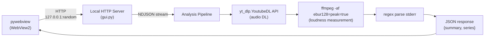

# analyze-loudness

YouTube 動画の音声ラウドネスを BS.1770 / EBU R128 準拠で分析するツール。
CLI 版と GUI アプリケーション版 (Windows / macOS) の 2 形態を持つ。

## Architecture overview


```mermaid
graph LR
    A["pywebview<br/>(WebView2)"] -->|"HTTP<br/>127.0.0.1:random"| B["Local HTTP Server<br/>(gui.py)"]
    B -->|"NDJSON stream"| C["Analysis Pipeline"]
    C --> D["yt_dlp.YoutubeDL API<br/>(audio DL)"]
    D --> E["ffmpeg -af ebur128=peak=true<br/>(loudness measurement)"]
    E --> F["regex parse stderr"]
    F --> G["JSON response<br/>{summary, series}"]
    G --> A
```

GUI は pywebview (WebView2) + ローカル HTTP サーバーで構成。

## Project structure

```
analyze-loudness/
├── .github/workflows/          # ci.yaml (PR/push), release.yaml (v* タグ), workflow-checks.yml (全 PR で uses: の SHA 固定を検査)
├── .gitignore
├── .venv/                      # Python venv (git 管理外)
├── CLAUDE.md
├── README.md
├── pyproject.toml              # CLI tool (pip install -e ".[dev]")
├── src/analyze_loudness/       # Python package
│   ├── __init__.py             # vendor への sys.path 注入, SCHEMA_VERSION
│   ├── __main__.py
│   ├── cli.py                  # argparse + main orchestration (CLI)
│   ├── gui.py                  # pywebview + local HTTP server (GUI)
│   ├── download.py             # yt_dlp.YoutubeDL API, ffprobe duration
│   ├── analysis.py             # ebur128 stderr parsing, compute_stats
│   └── plot.py                 # matplotlib figure generation (CLI only)
├── frontend/
│   ├── index.html
│   ├── main.js                 # fetch + NDJSON progress + DOM rendering + theme toggle
│   ├── theme.js                # getTheme() -- chart color provider (light/dark)
│   ├── gate.js                 # computeGate() -- BS.1770 gating rebuilt from series.M
│   ├── i18n.js                 # en/ja DICT + window.i18n.t / setLang / onChange
│   ├── charts/
│   │   ├── timeline.js         # uPlot wrapper (theme-aware, GATE lane plugin)
│   │   ├── histogram.js        # Canvas histogram (theme-aware, no internal title)
│   │   └── segments.js         # Canvas segment bars (theme-aware, no internal title)
│   ├── style.css               # CSS variables + [data-theme="dark"] rules
│   └── vendor/                 # uPlot (bundled)
├── tests/                      # pytest
│   ├── __init__.py
│   ├── conftest.py
│   ├── test_analysis.py
│   ├── test_cli.py
│   ├── test_download.py
│   ├── test_gui.py
│   ├── test_frontend.py        # Playwright headless Chromium runner
│   └── frontend/
│       ├── test_ui.html        # test harness page (DOM + stubs)
│       └── test_ui.js          # browser-based UI state tests
├── docs/
│   ├── architecture.md
│   ├── screenshot.png
│   └── security-audit.md
├── vendor/py-analyze-common/   # git submodule (sys.path 注入で利用)
├── build.py                    # Build script (asset download + PyInstaller + Inno Setup)
├── analyze-loudness.spec       # PyInstaller spec
├── installer.iss               # Inno Setup script
├── THIRD_PARTY_LICENSES.txt    # Bundled license file
└── build_assets/bin/           # ffmpeg, ffprobe, deno (git 管理外)
```

## CLI usage

```
python -m venv .venv
source .venv/bin/activate        # Windows: .venv\Scripts\activate
pip install -e ".[dev]"
analyze-loudness "https://www.youtube.com/watch?v=XXXXX"
analyze-loudness "https://..." --duration 10 --output-dir ./out
```

### CLI dependencies (installed via pip)

- `yt-dlp` -- pyproject.toml dependency (Python API 経由で利用)
- `ffmpeg` / `ffprobe` -- `static-ffmpeg` package; `shutil.which` check before import
- `numpy`, `matplotlib` -- CLI only
- `pytest` -- dev dependency (`pip install -e ".[dev]"`)

## GUI usage

### Development

```
pip install -e ".[gui]"
analyze-loudness-gui
```

### Build & Distribution

```bash
# Windows
.venv/Scripts/python build.py              # download assets + PyInstaller bundle
.venv/Scripts/python build.py --installer  # + Inno Setup installer (.exe)

# macOS (要 create-dmg: brew install create-dmg)
.venv/bin/python build.py
.venv/bin/python build.py --installer      # + DMG
```

フラグ: `--skip-download` (外部アセット取得をスキップ) / `--skip-build` (PyInstaller をスキップ、`dist/` がある前提) / `--update-checksums` (アセットを取得して `checksums.json` を更新)。

> **注意**: 必ずプロジェクト固有の venv の python (`.venv/bin/python` / `.venv/Scripts/python`) で実行すること。親ディレクトリの `python` や他プロジェクトの venv を使うと PyInstaller が依存を解決できない。

### GUI dependencies

- `pywebview` -- optional dependency (`pip install -e ".[gui]"`)
- `numpy` -- statistics computation
- `yt-dlp` -- Python ライブラリとしてバンドル (PyInstaller が自動的に含める)
- ffmpeg, ffprobe, deno -- bundled in build_assets/bin/ (PyInstaller frozen mode)
- `py-analyze-common` -- git submodule (`vendor/py-analyze-common`)。OS 判定・subprocess kwargs・ダークモード検出・ffmpeg/ffprobe ラッパー・yt-dlp ダウンロード・JSON 安全化を提供。pyproject.toml には記載せず `sys.path` 注入で利用

## テスト

```bash
pytest -q                                          # 全テスト
python -m playwright install --with-deps chromium  # 初回のみ (test_frontend.py が使う)
```

ブラウザバイナリの扱いは [フロントエンド UI テスト](#フロントエンド-ui-テスト) を参照。

## Design decisions

### ebur128 パース方式

`ffmpeg -af ebur128=peak=true -f null -` の stderr を正規表現 `t:\s*([\d.]+)\s+TARGET.*?M:\s*([-\d.]+)\s+S:\s*([-\d.]+)` でパース。Summary ブロックは `output.rfind("Summary")` 以降から Integrated / LRA / True Peak を取得。

### メモリ制約

50 分音声を WAV デコードすると 4 GB 超で OOM になる。
生デコードは行わず、ffmpeg ebur128 の stderr テキスト出力のみを処理する。

### 無音閾値

統計計算時は Short-term > -60 LUFS のフレームのみ使用 (`SILENCE_THRESHOLD`)。無音率は S < -40 LUFS
(`SILENCE_PCT_THRESHOLD`) で算出する。ただし **ebur128 のウォームアップフレームは分母から外す** —
S は 3 秒窓なので先頭 29 フレームは窓が埋まらず無音フロア -120.7 が出る。除外しないと 36 秒クリップの
無音が 8.1% と出る (実測、実体は 0.0%)。判定は `analysis.py` の `first_full_window()` / `compute_silence_pct()`
に集約し、CLI・GUI・matplotlib プロットの 3 箇所から共用する。

### 中盤抽出

`(総尺 - 抽出分数*60) / 2` を開始点として `ffmpeg -ss`/`-t` で ebur128 分析時に直接切り出し。ソースが指定分数より短い場合は全尺使用。

この機能は CLI の `--duration` オプションのみで公開する。GUI には分数入力 UI を実装しない方針 (URL 入力だけのシンプルなワークフローを維持、常に全尺分析)。GUI バックエンドの `/analyze` エンドポイントは `duration` フィールドを受理する validation を残しているが、フロントエンドからは送出されない。

### ダウンロード形式

opus (非圧縮 WAV より大幅に小さい)。`yt_dlp.YoutubeDL` の Python API を直接呼び出し、`FFmpegExtractAudio` postprocessor で抽出。`extract_info(download=True)` の戻り値からタイトルを取得するため、タイトル取得とダウンロードを並行実行する必要がない。

### yt-dlp Python API 採用 (非バイナリ)

`yt-dlp_macos` のような PyInstaller onefile バイナリを同梱すると、CI の codesign 再署名で内部 `Python.framework` の Team ID 不一致が発生する (macOS hardened runtime)。`yt-dlp` を Python 依存としてインストールし `YoutubeDL` クラスを直接使用することでこの問題を回避している。Windows / Linux でも同方式で統一。

### yt-dlp のバージョン固定

`pyproject.toml` で `yt-dlp==<version>` の完全一致ピンを持つ。ピン値は analyze-loudness / analyze-spectrum / py-analyze-common の 3 つの `pyproject.toml` が持つミラーで、必ず同時に更新する。

固定する理由: 出荷物は PyInstaller が yt-dlp を PYZ に焼き込むため、インストール後に更新できない。無指定にするとビルドした時点の解決結果で版が決まり、出荷物に入った版を事後に特定できない。

ピンの更新はリリース作業の一部として行う:

1. `pip install -U yt-dlp` で候補版を入れる
2. **全長ダウンロード**で確認する。`--test` (先頭 10 KiB のみ取得) では 403 を検出できない:
   `.venv/bin/python -m yt_dlp -f bestaudio -o <tmpdir>/%(id)s.%(ext)s <URL>`
   通常動画・ライブアーカイブ・Shorts の 3 種で確認する
3. 通った版を 3 つの `pyproject.toml` に書く。py-analyze-common を先にコミットし、submodule ポインタを更新する
4. 出荷物を再ビルドする

この節は analyze-spectrum の CLAUDE.md と同一内容のミラー。

### macOS は Apple Silicon (arm64) 専用 (v1.3.0+)

ffmpeg / ffprobe は osxexperts.net の arm64 ネイティブビルドを SHA256 ハードコード検証付きで取得する (`build.py` の `_OSXEXPERTS_ARM64`)。evermeet.cx (x86_64) は (a) bundle に Intel Mach-O が混入すると macOS 26 で「Intel プロセッサ用アプリの対応は終了します」警告が出る、(b) GitHub Actions macos runner から接続タイムアウトが発生するため不採用。Intel Mac サポートは v1.2.0 までで打ち切り。osxexperts URL はバージョン埋め込み (`ffmpeg81arm.zip` 等) のため ffmpeg メジャー更新時は URL + SHA256 を更新する。

### deno (yt-dlp 依存)

yt-dlp が YouTube の JavaScript 抽出に deno ランタイムを必要とする。`build.py` で最新版をダウンロードしバンドルする。

### ローカル HTTP サーバー + pywebview

127.0.0.1 のランダムポート (port 0) で HTTPServer を起動。pywebview (WebView2) でウインドウを表示。
NDJSON ストリーミングでリアルタイム進捗表示。runtime-calibrated `_speed_factor` で残り時間を推定。

### GUI エンドポイント

| Endpoint | Method | Description |
|----------|--------|-------------|
| `/analyze` | POST | URL から音声をダウンロードし EBU R128 分析。NDJSON ストリーム応答 |
| `/save` | POST | 分析結果 JSON をネイティブファイルダイアログで保存 |
| `/save-image` | POST | チャート composite PNG (base64) をネイティブダイアログで保存 |
| `/load` | POST | ネイティブダイアログで JSON を選択し、結果を再可視化 |

### ダークモード

CSS 変数 + `[data-theme="dark"]` でライト/ダーク/auto の 3 ステートテーマ切替。
デフォルトは `auto` (OS の `prefers-color-scheme` に追従)。選択は `localStorage("loudness-theme")` に保存。
テーマ切替 UI は fixed top-right pill ボタン (☾/☀/◐)。analyze-spectrum と統一。
チャート色は `theme.js` の `getTheme()` で一元管理し、テーマ切替時にチャートを再描画。

### i18n (多言語)

`frontend/i18n.js` で en / ja の 2 言語を管理。ただし表・グラフの表示項目 (table.*, chart.*, summary.frames/min 等) は analyze-spectrum と統一して英語のみとする。ja 辞書にもこれらのキーには英語値を入れる。ボタン・ステータス・エラーメッセージ等の UI クロムは日本語訳を維持。

### チャートタイトルの単独描画 (analyze-spectrum と統一)

各チャート (timeline / histogram x2 / segments) のタイトルは HTML `<h3 class="chart-title">` のみで描画し、Canvas / uPlot の `ctx.fillText` や `title:` オプションは使わない。canvas 内描画は二重表示と PNG エクスポート時の重複を招くため禁止 (`captureImage()` が `chartTitles` 配列で composite PNG にタイトルを焼き込む)。HTML タイトルは `_addTip()` でツールチップ (`tip.chart_timeline` / `tip.chart_histogram` / `tip.chart_segments`) を持つ。

`role="img"` + `aria-label` は histogram では canvas 自体に、timeline / segments ではコンテナ div に付与する。タイトルは必ずそのノードの外側に置く (ARIA が `role="img"` の子孫を presentational 扱いするため、内側だとタイトルとツールチップ本文が支援技術に渡らない)。

### GATE レーン (タイムラインの除外区間表示)

Integrated は BS.1770 の絶対ゲート (-70 LUFS) と相対ゲート (絶対ゲート通過ブロックの平均 -10 LU) を
越えた 400 ms ブロックのみを集計する。Timeline の x 軸ガター (プロット下端とメモリラベルの間) に
高さ 12 px の帯を置き、除外ブロックを琥珀色 (相対ゲート以下) / スレート (絶対ゲート以下) で示す。

ffmpeg は 100 ms ごとにフレームを出すが Momentary 窓は 400 ms のため、**先頭 3 フレーム
(t = 0.1 / 0.2 / 0.3) は窓が埋まっておらず、無音フロア -120.7 が出る**。これらはゲート対象ブロックでは
ないので `computeGate` は `series.t` から先頭を判定して除外する (`_firstGatedIndex`)。除外しないと
無音率と分母の両方が膨らみ、実測では 36 秒クリップの無音 0.91% がすべてこのウォームアップだった。
判定は `t[0]` 相対で行うため `-ss` で切り出した場合も効く。S (3 秒窓) のウォームアップは 29 フレームで、
こちらは summary の無音率が同じ規則で除外する ([無音閾値](#無音閾値))。

相対ゲートの値は `summary.gate_threshold` (schema 2) を使い、無い場合のみ `frontend/gate.js` の
`computeGate()` が `series.M` から再計算する。schema 1 で保存した JSON はこのフォールバック経路に乗る。
再計算した Integrated は保存済み JSON 13 本すべてで保存値と 0.05 LU 以内に一致するため、
どちらの経路でも帯は出る。`series.M` の長さが `series.t` と一致しない JSON では帯を出さない
(時間軸との対応が保証できないため)。

ffmpeg の Summary には `Threshold:` が **2 行**ある (Integrated 側と LRA 側)。
`analysis.py` の正規表現は `I:` の行に錨を打って前者を取る。後者は別物。

ffmpeg が出す値は小数 1 桁に丸められているため、2 経路の結果は完全一致しない。丸めで判定が変わるのは
しきい値ちょうどに乗ったブロックだけで、実測では最大 303 / 95,957 ブロック (算入率で 0.3 ポイント)。
ffmpeg の Integrated をより忠実に再現するのは 13 本中 12 本で 1 桁側だった。

### JSON schema version

`SCHEMA_VERSION` は `src/analyze_loudness/__init__.py`。`__version__` (アプリ版数) とは独立に上げる。

| ver | 追加 |
|-----|------|
| 1 | 初版 |
| 2 | `summary.gate_threshold` — ffmpeg の相対ゲート。無い場合はフロントエンドが `series.M` から再計算。あわせて `summary.silence_pct` が ebur128 のウォームアップフレームを分母から外すようになった (schema 1 で保存済みの値は旧算出のまま) |

`/load` は `meta.schema_version` が int であることだけを検証し、値では弾かない。
新フィールドは**バージョン番号ではなく有無で分岐する** — 手編集された JSON で欠落しうるため。

帯の場所は x 軸の `gap` / `size` とチャート高さを同じ 11 px ずつ広げて作る。プロット bbox は帯の
有無で変わらない (2160x540 device px, 実測)。1 画素列に算入・除外が混在する場合は除外として描くため、
長尺では帯の塗り面積が実際の除外率を上回る。ドラッグズームすると実際の除外区間に収束する。

色は `theme.js` の `gateTrack` / `gateOut` / `gateSilent` と CSS 変数
`--gate-track` / `--gate-out` / `--gate-silent` の 2 か所に定義がある (canvas 用と凡例 chip 用)。
片方だけ変えると凡例と帯の色がずれる。

### フロントエンド UI テスト

`tests/frontend/test_ui.html` + `test_ui.js` を `tests/test_frontend.py` (Playwright + headless Chromium) で実行。`fmt`, `_setBusy`, `_addTip`, theme/lang トグル, /analyze + /load の fetch モック経路, 辞書キー網羅性などを検証。`test_ui.html` は `<script>localStorage.setItem("loudness-lang","en")</script>` を `i18n.js` 読み込み前に置いて言語決定性を確保する (項目 103, 104)。

CI (GitHub Actions) では `pip install -e ".[dev]"` で Playwright Python パッケージは入るが、ブラウザバイナリは別途 `python -m playwright install --with-deps chromium` ステップが必要。`tests/test_frontend.py` は `_HAS_PLAYWRIGHT` (パッケージ import 可否) のみで `skipif` するため、バイナリ未インストールだと `BrowserType.launch` が実行時にエラーになる。analyze-spectrum 側と同形式の専用ステップを `.github/workflows/ci.yaml` に置く。

### 分析キャンセル

Analyze ボタンが分析中に Cancel ボタンに変化。`AbortController` で fetch + NDJSON ストリーム読み取りを中断。
`_isBusy` フラグで Load ボタンを無効化し、二重実行を防止。

### ウィンドウアイコン

PyInstaller の `EXE(icon=...)` は EXE ファイル自体のアイコン (エクスプローラー表示用) のみ。pywebview のウィンドウアイコン (タイトルバー・タスクバー) には `webview.start(icon=...)` で明示指定が必要 (pywebview 6.x で `create_window` から `start` に移動)。`build_assets/icon.ico` を PyInstaller の `datas` でバンドルし、`_ICON_PATH` で解決する。

Windows のタスクバーは AppUserModelID でプロセスをグループ化する。未設定だと Python ランタイムのデフォルト ID が使われ、EXE 埋め込みアイコンがタスクバーに反映されない。`_set_application_user_model_id()` で `com.semnil.loudness-analyzer` を設定し、タスクバーアイコンを正しく表示する。

### Windows subprocess コンソール非表示

PyInstaller frozen mode では `STARTF_USESHOWWINDOW` で ffmpeg / ffprobe のコンソールウインドウを非表示。yt-dlp は Python API として動作するため subprocess 起動しない。

## Response format (GUI NDJSON)

Progress events:
```json
{"type":"progress","stage":"download","message":"Downloading audio..."}
{"type":"progress","stage":"analyze","message":"Running EBU R128 analysis...","estimate_sec":12,"duration_sec":600}
```

Result event:
```json
{
  "type": "result",
  "data": {
    "meta": {
      "schema_version": 2,
      "version": "1.0.0",
      "analyzed_at": "2026-04-03T12:34:56+00:00",
      "source_url": "https://www.youtube.com/watch?v=..."
    },
    "title": "Video Title",
    "summary": {
      "duration_sec": 600, "frames": 5999,
      "integrated": -18.1, "true_peak": 0.8, "lra": 9.3,
      "gate_threshold": -28.5,
      "short_term": { "median": -19.4, "mean": -20.5, "p10": -24.1, "p90": -15.4 },
      "momentary": { "median": -20.8, "mean": -21.3, "p10": -26.9, "p90": -14.4 },
      "silence_pct": 1.0
    },
    "series": { "t": [...], "S": [...], "M": [...] }
  }
}
```

## Time budget (10 min analysis)

| Stage              | Time    |
|--------------------|---------|
| yt_dlp API audio DL| 3-8 s   |
| ffmpeg ebur128     | ~11 s   |
| stderr parse + JSON| <1 s    |
| **Total**          | **~20 s** |

## Implementation status

All items implemented and tested.

1. `src/analyze_loudness/` -- CLI + GUI 共通パッケージ
2. `src/analyze_loudness/gui.py` -- pywebview GUI (NDJSON progress, runtime time estimation, save/load/image)
3. `frontend/` -- SPA (uPlot + 自前チャート, NDJSON progress, JSON/Image save, JSON load + 再可視化)
4. `build.py` + `analyze-loudness.spec` + `installer.iss` -- ビルド + インストーラー (SHA256 検証)
5. `tests/` -- pytest (analysis, cli, download, gui, frontend)
6. `docs/` -- 設計ドキュメント + セキュリティ監査レポート (`docs/security-audit.md`)

## リリース手順

1. `src/analyze_loudness/__init__.py` の `__version__` を上げる PR を出す (版上げは他の変更を含めない)
2. マージ後、master の HEAD に `vX.Y.Z` タグを打って push する
3. `release.yaml` が Windows インストーラー (`LoudnessAnalyzer-X.Y.Z-setup.exe`) と macOS DMG (`Loudness-Analyzer.dmg`) をビルドし、Release を作成する (`draft: true`)
4. Release の publish は人が行う

タグ push が唯一のリリーストリガー (他に `workflow_dispatch`)。マージだけではリリースされない。

## バージョン管理

唯一の定義元は `src/analyze_loudness/__init__.py` の `__version__`。他のファイルはすべてここから動的に取得する:

| ファイル | 取得方式 |
|----------|----------|
| `pyproject.toml` | `[tool.hatch.version]` `path` (regex 抽出、import なし) |
| `analyze-loudness.spec` | `_read_version()` で regex 読み取り |
| `installer.iss` | `build.py` の `_build_inno()` が `/DMyAppVersion=` で注入 |

バージョンバンプ時は `__init__.py` の `__version__` のみ変更する。

## Known limitations / future work

- yt-dlp の YouTube 仕様変更追従 -> リリースごとに `pyproject.toml` のピンを更新する
- 比較モード未実装 (2 URL のオーバーレイ比較グラフ)
- `_speed_factor` はグローバル変数で複数リクエスト間で共有 (GUI は単一ユーザー想定のため実質問題なし)
