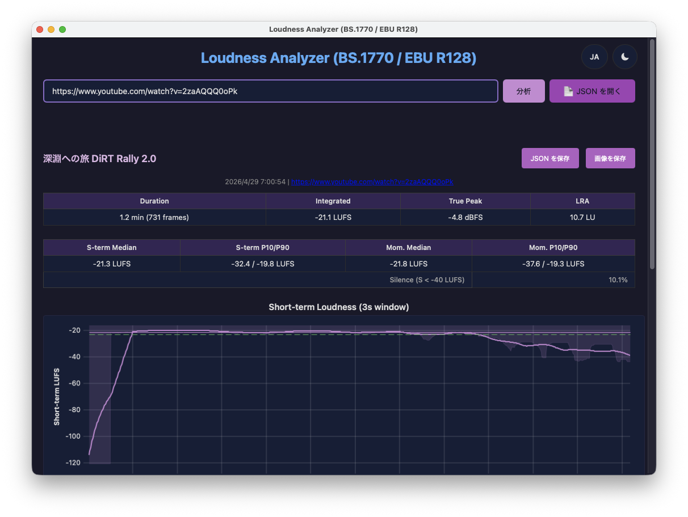
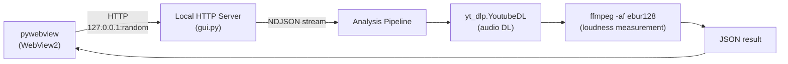

# analyze-loudness

YouTube 動画の音声ラウドネスを BS.1770 / EBU R128 準拠で分析するツール。
CLI 版と Windows GUI アプリケーション版の 2 形態を持つ。



## 機能

- YouTube 動画の音声をダウンロード (yt_dlp Python API, opus 形式)
- EBU R128 ラウドネス分析 (Momentary 400ms / Short-term 3s)
- 数値サマリー (Integrated, True Peak, LRA, 中央値, P10/P90, 無音率)
- CLI: 4 段構成の PNG グラフ生成 (matplotlib)
- GUI: ブラウザ上でインタラクティブなグラフ描画 (uPlot + Canvas)
- 分析結果の JSON 保存

## アーキテクチャ



GUI は pywebview (WebView2) + ローカル HTTP サーバーで構成。

## ローカル環境構築

### 前提条件

- Python 3.11+
- ffmpeg / ffprobe (システムにインストール済みなら `static-ffmpeg` は不要)

### セットアップ

```bash
git clone <repo-url>
cd analyze-loudness

python -m venv .venv
source .venv/bin/activate        # Windows: .venv\Scripts\activate
pip install -e ".[dev]"

python -m pytest tests/ -v
```

### CLI 使い方

```bash
# 全尺分析
analyze-loudness "https://www.youtube.com/watch?v=XXXXX"

# 中盤 10 分を分析、出力先を指定
analyze-loudness "https://www.youtube.com/watch?v=XXXXX" \
    --duration 10 \
    --output-dir ./out
```

#### CLI オプション

| オプション | デフォルト | 説明 |
|---|---|---|
| `--duration` | なし (全尺) | 分析対象の長さ (分)。動画の中央部分を切り出して分析する |
| `--output-dir` | `.` | PNG 出力ディレクトリ |

#### CLI 出力例

```
========================================================
  Video Title
========================================================
  Duration          : 30.5 min (18265 frames)
  Integrated        : -20.8 LUFS
  True Peak (max)   : +0.3 dBFS
  LRA               : 4.5 LU
  Short-term median : -21.4 LUFS
  Short-term P10/P90: -24.3 / -20.1 LUFS
  Momentary  median : -21.2 LUFS
  Momentary  P10/P90: -34.8 / -19.2 LUFS
  Silence (S<-40)   : 13.8%
========================================================
```

### GUI 使い方

```bash
pip install -e ".[gui]"
analyze-loudness-gui
```

GUI は URL 入力のみを受け付け、常に全尺を分析する。`--duration` 相当 (分析対象長の指定) は GUI に実装しない。中盤のみを分析したい場合は CLI の `--duration` オプションを使用する。

### ビルド & 配布 (Windows)

```bash
python build.py              # download assets + PyInstaller bundle
python build.py --installer  # + Inno Setup installer (.exe)
```

## テスト

```bash
source .venv/bin/activate        # Windows: .venv\Scripts\activate
python -m pytest tests/ -v
```

30 テスト: CLI (analysis, cli, download)

## プロジェクト構成

```
analyze-loudness/
├── .gitignore
├── .venv/                      # Python 仮想環境 (git 管理外)
├── CLAUDE.md                   # AI 向けプロジェクト指示書
├── README.md
├── pyproject.toml              # CLI tool (pip install -e ".[dev]")
├── src/analyze_loudness/       # Python package
│   ├── __init__.py             # _subprocess_kwargs() helper
│   ├── __main__.py
│   ├── cli.py                  # argparse + main orchestration (CLI)
│   ├── gui.py                  # pywebview + local HTTP server (GUI)
│   ├── download.py             # yt_dlp.YoutubeDL API, ffprobe duration
│   ├── analysis.py             # ebur128 stderr parsing, compute_stats
│   └── plot.py                 # matplotlib figure generation (CLI only)
├── frontend/
│   ├── index.html
│   ├── main.js                 # fetch + NDJSON progress + DOM rendering
│   ├── charts/
│   │   ├── timeline.js         # uPlot wrapper
│   │   ├── histogram.js        # Canvas histogram
│   │   └── segments.js         # Canvas segment bars
│   ├── style.css
│   └── vendor/                 # uPlot (bundled)
├── tests/
│   ├── test_analysis.py
│   ├── test_cli.py
│   └── test_download.py
├── docs/
│   ├── architecture.md
│   └── security-audit.md
├── build.py                    # Build script (asset download + PyInstaller + Inno Setup)
├── analyze-loudness.spec       # PyInstaller spec
├── installer.iss               # Inno Setup script
├── THIRD_PARTY_LICENSES.txt    # Bundled license file
└── build_assets/bin/           # ffmpeg, ffprobe, deno (git 管理外)
```
