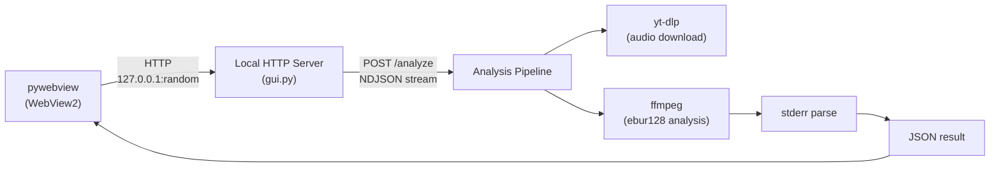
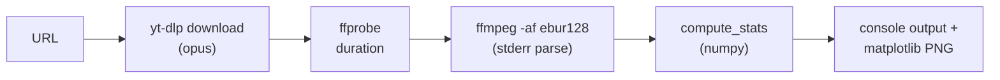
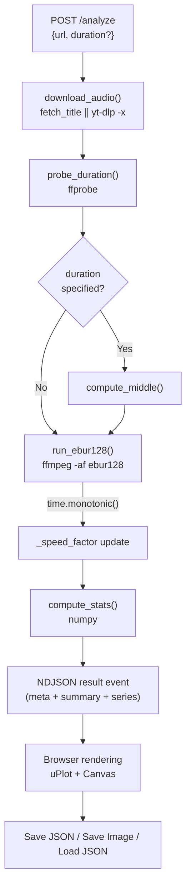

# Architecture Design Document

## Overview

analyze-loudness は YouTube 動画の音声ラウドネスを BS.1770 / EBU R128 準拠で分析するツール。
CLI ツールとしてローカル実行可能であり、Windows GUI アプリケーション (pywebview) としても提供する。

## System Architecture



## Components

### CLI Tool (`src/analyze_loudness/`)

| Module | Responsibility |
|--------|---------------|
| `cli.py` | argparse + orchestration, static-ffmpeg PATH setup |
| `download.py` | yt-dlp download + title取得 (並行実行), ffprobe duration, filename sanitization |
| `analysis.py` | ffmpeg ebur128 stderr parsing, numpy-based statistics |
| `plot.py` | matplotlib 4-row figure generation (timeline, histograms, segments) |

### GUI Application (`src/analyze_loudness/gui.py`)

| Component | Responsibility |
|-----------|---------------|
| `AnalyzeHandler` | `SimpleHTTPRequestHandler` 継承。frontend 配信 + POST エンドポイント処理 |
| `do_POST()` | `/analyze`, `/save`, `/save-image`, `/load` のルーティング |
| `_run_analysis()` | download -> probe -> ebur128 (計時) -> stats -> result の NDJSON ストリーム |
| `_handle_save()` | JSON 保存 (ネイティブファイルダイアログ) |
| `_handle_save_image()` | base64 PNG → バイナリ保存 (ネイティブファイルダイアログ) |
| `_handle_load()` | JSON 読み込み + バリデーション (ネイティブファイルダイアログ) |
| `_speed_factor` | runtime-calibrated 速度係数。分析時間から次回の推定時間を算出 |
| `main()` | HTTPServer (127.0.0.1:0) 起動 + pywebview ウインドウ表示 |

### Frontend (`frontend/`)

| File | Responsibility |
|------|---------------|
| `index.html` | SPA entry point, local vendor files |
| `main.js` | Fetch orchestration, NDJSON progress parsing, DOM rendering, save/load/image capture, theme toggle, cancel (AbortController) |
| `theme.js` | `isDark()`, `getTheme()` — theme detection + chart color provider |
| `charts/timeline.js` | uPlot time series (60-frame moving average, theme-aware) |
| `charts/histogram.js` | Canvas density histogram (theme-aware) |
| `charts/segments.js` | Canvas 5-min segment bar chart (theme-aware) |
| `style.css` | CSS variables + `[data-theme="dark"]` rules, purple accent (#9C27B0) |
| `vendor/` | uPlot.iife.min.js, uPlot.min.css (bundled) |

### Shared Utilities (`src/analyze_loudness/__init__.py`)

| Function | Responsibility |
|----------|---------------|
| `_subprocess_kwargs()` | Windows frozen mode で subprocess のコンソールウインドウを非表示にする |

## Data Flow

### CLI



### GUI



### NDJSON Progress Stream

GUI の `/analyze` エンドポイントは `application/x-ndjson` でストリーミング応答する:

```
{"type":"progress","stage":"download","message":"Downloading audio..."}
{"type":"progress","stage":"download","message":"Downloaded: Video Title"}
{"type":"progress","stage":"analyze","message":"Running EBU R128 analysis...","estimate_sec":12,"duration_sec":600}
{"type":"progress","stage":"stats","message":"Computing statistics..."}
{"type":"result","data":{...}}
```

## Key Design Decisions

### 1. ebur128 stderr parsing (not WAV decoding)

ffmpeg の ebur128 フィルタは stderr にフレーム毎のラウドネス値を出力する。
50分の音声を WAV デコードすると 4GB 超のメモリが必要になるため、
stderr テキストのみを処理し、メモリ消費を数MB に抑えている。

### 2. Local HTTP server + pywebview

pywebview は OS のネイティブ WebView (Windows: WebView2) を使用し、
バンドルサイズを小さく保てる。
`HTTPServer` を 127.0.0.1 のランダムポート (port 0) で起動し、
same-origin で frontend を配信する。

### 3. Runtime-calibrated time estimation

`_speed_factor` を分析の実測時間から更新し、次回以降の推定精度を向上。
初期値は 55.0 (実時間の約 55 倍速) で、各分析完了後に `analyze_sec / elapsed` で更新。

### 4. Parallel title fetch + download

タイトル取得 (`fetch_title`: `--print title --no-download`) とダウンロード (`yt-dlp -x`) を `ThreadPoolExecutor` で並行実行。`--print` と `-x` を同時に使うと一部の yt-dlp バージョンでダウンロードが行われない互換性問題を回避。

### 5. Middle extraction

長時間動画は中盤のみを分析する。`ffmpeg -ss <start> -t <duration>` で
ebur128 分析時に直接切り出し。

### 6. Conditional static-ffmpeg (CLI only)

CLI ではシステムに ffmpeg がインストールされていれば `static-ffmpeg` を使わない。
`shutil.which("ffmpeg")` で検出し、不在時のみ `static_ffmpeg.add_paths()` を呼ぶ。

### 7. Dark mode (light / dark / auto)

CSS 変数 (`--bg`, `--fg`, `--accent` 等) + `[data-theme="dark"]` でテーマを切り替え。
`theme.js` の `getTheme()` がチャート描画時のカラーパレットを返す。
fixed top-right pill ボタン (☾/☀/◐) で light → dark → auto をサイクル。
`auto` は OS の `prefers-color-scheme` に追従し、`matchMedia` の `change` イベントでリアルタイム反映。
選択は `localStorage("loudness-theme")` に永続化。UI は analyze-eq プロジェクトと統一。

### 8. Analysis cancel (AbortController)

分析中に Analyze ボタンが Cancel に変化 (赤色)。`AbortController.signal` を `fetch()` と
NDJSON `ReadableStream.getReader()` に渡し、キャンセル時にストリーム読み取りを中断。
`_isBusy` フラグで Load ボタンを無効化し、二重実行を防止。

### 9. Windows subprocess console hiding

PyInstaller frozen mode では `subprocess.STARTUPINFO` + `STARTF_USESHOWWINDOW` で
yt-dlp / ffmpeg / ffprobe のコンソールウインドウを非表示にする。

## Build & Distribution

### CLI

```bash
python -m venv .venv
source .venv/bin/activate        # Windows: .venv\Scripts\activate
pip install -e ".[dev]"
analyze-loudness "https://www.youtube.com/watch?v=XXXXX"
```

### GUI (PyInstaller + Inno Setup)

```bash
python build.py              # download assets + PyInstaller bundle
python build.py --installer  # + Inno Setup installer
```

Build pipeline:
1. `build.py --skip-download` or auto-download: yt-dlp, ffmpeg, uPlot
2. PyInstaller (`analyze-loudness.spec`): bundles Python + dependencies + frontend + binaries
3. Inno Setup (`installer.iss`): Windows installer with license display

### Bundled Assets (`build_assets/bin/`)

| Binary | Source | License |
|--------|--------|---------|
| yt-dlp.exe | GitHub Releases (latest) | Unlicense |
| deno.exe | GitHub Releases (latest) | MIT |
| ffmpeg.exe | BtbN/FFmpeg-Builds (latest) | GPL-2.0+ |
| ffprobe.exe | BtbN/FFmpeg-Builds (latest) | GPL-2.0+ |

## Constants

| Constant | Value | Location | Description |
|----------|-------|----------|-------------|
| SILENCE_THRESHOLD | -60 LUFS | analysis.py | Stats exclude frames <= this |
| _speed_factor | 55.0 (initial) | gui.py | Runtime-calibrated analysis speed |
| Segment size | 5 min | plot.py, segments.js | Bar chart segment width |
| Moving average window | 60 frames | plot.py, timeline.js | Timeline smoothing window |
| Downsample target | ~3000 points | plot.py | Plot responsiveness |
| Default theme | "system" | main.js | OS prefers-color-scheme 追従 |
| Theme storage key | "theme" | main.js | localStorage persistence key |
