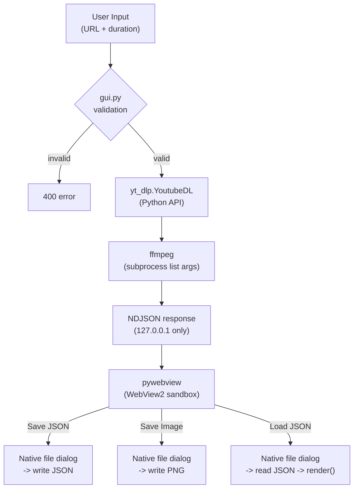

# Security Audit Report

**Date**: 2026-04-04
**Scope**: CLI (`src/analyze_loudness/`), GUI (`src/analyze_loudness/gui.py`), Frontend SPA (`frontend/`), Build/Distribution (`build.py`, `analyze-loudness.spec`, `installer.iss`)

## Summary

| Category | Findings | Open | Resolved | Accepted |
|----------|----------|------|----------|----------|
| Local HTTP Server | 2 | 0 | 1 | 1 |
| Input Validation | 3 | 0 | 3 | 0 |
| Command Injection | 1 | 0 | 0 | 1 |
| File I/O (Save/Load) | 3 | 0 | 0 | 3 |
| Data Exposure | 1 | 0 | 0 | 1 |
| XSS | 1 | 0 | 0 | 1 |
| Subprocess Management | 2 | 0 | 1 | 1 |
| Bundled Binaries | 2 | 0 | 2 | 0 |
| Resource Management | 1 | 0 | 0 | 1 |
| **Total** | **16** | **0** | **7** | **9** |

**Open: 0** / Resolved: 7 / Accepted (risk acknowledged): 9

---

## Resolved Findings

### SEC-01: バンドルバイナリの整合性検証 -- RESOLVED

- **Risk**: LOW -> RESOLVED
- **Location**: [build.py](../build.py), [build_assets/checksums.json](../build_assets/checksums.json)
- **Resolution**: `build_assets/checksums.json` にダウンロード済みアセット (ffmpeg, ffprobe, deno, uPlot) の SHA256 ハッシュをプラットフォーム別 (`windows` / `macos`) に記録。ビルド時に `_PLATFORM_KEY` で現在のプラットフォームのハッシュを照合し、不一致で停止する。
  - `python build.py --update-checksums`: ダウンロード + ハッシュ算出 + checksums.json 更新
  - `python build.py`: ダウンロード + checksums.json と照合 (不一致で停止)
  - checksums.json は git 管理対象
  - JSON 構造は analyze-spectrum と統一 (`{ "windows": {...}, "macos": {...} }`)

### SEC-02: ローカル HTTP サーバーがループバック以外からアクセス可能 -- RESOLVED

- **Risk**: LOW -> RESOLVED
- **Location**: [gui.py:293](../src/analyze_loudness/gui.py)
- **Resolution**: `HTTPServer(("127.0.0.1", 0), ...)` で 127.0.0.1 にバインド。外部ネットワークからのアクセス不可。ポートは OS が自動割当 (port 0) するため、他アプリとの競合も回避。

### SEC-03: URL 入力のバリデーション (GUI) -- RESOLVED

- **Risk**: LOW -> RESOLVED
- **Location**: [gui.py:73-75](../src/analyze_loudness/gui.py)
- **Resolution**: `url` フィールドの存在と `str` 型をチェック。空文字列は 400 エラーで拒否。
- **Note**: ユーザー自身が URL を入力し、ローカルマシンから YouTube にアクセスする。

### SEC-04: duration パラメータのバリデーション -- RESOLVED

- **Risk**: LOW -> RESOLVED
- **Location**: [gui.py:77-85](../src/analyze_loudness/gui.py)
- **Resolution**: `float()` 変換 + 正数チェック。不正値は 400 エラーで拒否。

### SEC-05: Windows subprocess コンソール非表示 -- RESOLVED

- **Risk**: LOW -> RESOLVED
- **Location**: [__init__.py](../src/analyze_loudness/__init__.py)
- **Resolution**: `_subprocess_kwargs()` で frozen mode 時に `STARTF_USESHOWWINDOW` を設定。subprocess のコンソールウインドウを抑制し、UX を改善。

### SEC-06: バンドルバイナリのバージョン管理 -- RESOLVED

- **Risk**: MEDIUM -> RESOLVED
- **Location**: [build.py](../build.py)
- **Resolution**: `build.py` が GitHub API から最新安定版を取得。`--skip-download` フラグで既存バイナリの再利用も可能。HTTPS 経由でダウンロード。

### SEC-15: 不正 JSON リクエストボディの処理 -- RESOLVED

- **Risk**: LOW -> RESOLVED
- **Location**: [gui.py:44-49](../src/analyze_loudness/gui.py)
- **Resolution**: `_read_json_body()` で `JSONDecodeError` / `ValueError` を catch し、空 dict を返す。不正なリクエストボディで 500 エラーが発生しない。

---

## Accepted Findings (risk acknowledged)

### SEC-07: ローカル HTTP サーバーの同一ホスト攻撃面 -- ACCEPTED

- **Risk**: VERY LOW
- **Location**: [gui.py:293](../src/analyze_loudness/gui.py)
- **Analysis**: 127.0.0.1 バインドのため、同一マシン上の他プロセスからは `/analyze` エンドポイントにアクセス可能。ただし:
  - ポートはランダム (port 0) のため予測困難
  - ブラウザの same-origin policy により、外部サイトからの CSRF は Content-Type: application/json の POST が preflight で阻止される
  - ローカルアプリの標準的な設計パターン
  - 最悪でも YouTube 音声の分析が実行されるのみ（データ破壊なし）

### SEC-08: subprocess への URL 直接渡し -- SAFE

- **Risk**: NOT VULNERABLE
- **Location**: [download.py:57-63](../src/analyze_loudness/download.py)
- **Analysis**:
  - `subprocess.run(cmd, ...)` リスト引数 (`shell=False`) -> shell injection 不可
  - ユーザーが自分で入力した URL をローカルで実行するため、攻撃ベクトルが成立しない

### SEC-09: フロントエンド XSS -- SAFE

- **Risk**: NOT VULNERABLE
- **Location**: [main.js](../frontend/main.js)
- **Analysis**:
  - `title` -> `textContent` (HTML パース不可)
  - `innerHTML` テーブル -> `fmt()` の `.toFixed()` 出力のみ (数値 -> 文字列)
  - ユーザー由来文字列は `innerHTML` パスに含まれない

### SEC-10: エラーメッセージによる内部情報 -- ACCEPTED

- **Risk**: VERY LOW
- **Location**: [gui.py:97](../src/analyze_loudness/gui.py)
- **Analysis**: エラーメッセージは NDJSON で 127.0.0.1 にのみ送信される。ローカルアプリのためデバッグ情報の露出リスクは実質ゼロ。

### SEC-11: 一時ファイルのクリーンアップ -- SAFE

- **Risk**: NOT VULNERABLE
- **Location**: [gui.py:100](../src/analyze_loudness/gui.py), [cli.py](../src/analyze_loudness/cli.py)
- **Analysis**: `tempfile.TemporaryDirectory` + `with` ブロック。分析完了後に自動削除。

### SEC-12: `/save` エンドポイントによるファイル書き込み -- ACCEPTED

- **Risk**: VERY LOW
- **Location**: [gui.py:175-205](../src/analyze_loudness/gui.py)
- **Analysis**: `/save` POST で JSON データをユーザー選択パスに書き込み可能。ただし:
  - 保存先パスは pywebview のネイティブファイルダイアログでユーザーが選択
  - 127.0.0.1 + ランダムポートのため外部からのアクセス不可
  - 書き込みエラーは OSError でキャッチし、エラーレスポンスを返却
  - 書き込む内容は分析結果 JSON のみ (実行可能コードではない)

### SEC-13: `/save-image` エンドポイントによる PNG 書き込み -- ACCEPTED

- **Risk**: VERY LOW
- **Location**: [gui.py:207-235](../src/analyze_loudness/gui.py)
- **Analysis**: `/save-image` POST で base64 エンコード PNG をユーザー選択パスに書き込み。
  - `data:image/png;base64,` prefix を検証し、不正な形式は 400 で拒否
  - `base64.b64decode` が不正な base64 を `ValueError` として拒否（catch 済み）
  - 保存先は SEC-12 と同様にネイティブダイアログでユーザーが選択
  - 127.0.0.1 + ランダムポートのため外部からの呼び出し不可

### SEC-14: `/load` エンドポイントによるファイル読み込み -- ACCEPTED

- **Risk**: VERY LOW
- **Location**: [gui.py:237-261](../src/analyze_loudness/gui.py)
- **Analysis**: `/load` POST でユーザー選択パスから JSON を読み込み、フロントエンドに返却。
  - 読み込みパスは pywebview のネイティブファイルダイアログでユーザーが選択
  - `summary` と `series` フィールドの存在を検証し、不正な JSON は 400 で拒否
  - `OSError` / `JSONDecodeError` を catch しエラーレスポンスを返却
  - 読み込んだデータはフロントエンドの `render()` に渡されるが、ユーザー由来文字列は `textContent` 経由で安全に表示（SEC-09 参照）
  - 127.0.0.1 + ランダムポートのため外部からの呼び出し不可

### SEC-16: クライアント切断時の subprocess orphaning -- ACCEPTED

- **Risk**: LOW
- **Location**: [gui.py:116-148](../src/analyze_loudness/gui.py), [download.py](../src/analyze_loudness/download.py)
- **Analysis**: フロントエンドの Cancel (AbortController) でストリーム読み取りを中断すると、サーバー側の `_send_event()` が `_ClientDisconnected` を発生させて分析を中断する。ただし `yt_dlp.YoutubeDL.extract_info()` や `subprocess.run()` (ffmpeg) がブロッキング中の場合、該当処理は完了まで実行が継続する。
  - `_ClientDisconnected` は次の `_send_event()` 呼び出し時にのみ検出される
  - yt_dlp ダウンロード中 (3-8秒) や ffmpeg 分析中 (~11秒) にキャンセルしても、該当処理は完了まで実行
  - 完了後に `_send_event()` が `_ClientDisconnected` を送出し、以降の処理を中断
  - `TemporaryDirectory` は `with` ブロック終了時にクリーンアップされるため、一時ファイルのリークは発生しない
  - 修正には `subprocess.Popen` ベースに変更し、キャンセル時に `process.kill()` する必要があるが、単一ユーザーのローカルアプリでは実害が小さく、複雑性増加に見合わない
- **Accepted**: 最大でも十数秒の不要な subprocess 実行のみ。DoS やリソース枯渇のリスクなし

---

## Threat Model

### Attack Surface

| Entry Point | Protocol | Auth | Validation |
|------------|----------|------|------------|
| CLI args | Local | N/A | argparse + `_positive_float` |
| GUI HTTP | 127.0.0.1 only | N/A (localhost) | URL + duration + JSON body validation |
| Frontend SPA | pywebview (WebView2) | N/A | Static files, no SSR |
| File dialogs | Native OS | User interaction required | pywebview SAVE_DIALOG / OPEN_DIALOG, `_dialog_lock` non-blocking try-lock (409 on concurrent) |

### Abuse Scenarios

| Scenario | Impact | Mitigation | Status |
|----------|--------|------------|--------|
| External network access | Remote attack | 127.0.0.1 bind | Not vulnerable |
| Shell injection via URL | RCE | `subprocess.run` list args | Not vulnerable |
| Malicious bundled binary | Code execution | SHA256 checksum verification | Resolved (SEC-01) |
| Local CSRF | Unintended analysis | Random port, Content-Type preflight | Very low risk |
| Disk exhaustion (large video) | DoS | `TemporaryDirectory` auto-cleanup | Low risk |
| Arbitrary file write via /save | Data overwrite | Native dialog + 127.0.0.1 + random port | Very low risk |
| Arbitrary file read via /load | Info disclosure | Native dialog + 127.0.0.1 + random port | Very low risk |
| XSS via loaded JSON title | Code execution | `textContent` (no HTML parse) | Not vulnerable |
| Invalid base64 in /save-image | Server crash | `ValueError` caught | Resolved |
| Cancel during subprocess | Orphaned process (~11s) | `_ClientDisconnected` + `TemporaryDirectory` cleanup | Accepted (low) |

## Compliance Notes

- No user data stored (stateless analysis, temp files auto-deleted)
- No authentication tokens or cookies
- No PII processing
- No network listeners on external interfaces
- YouTube content analyzed locally, deleted after display
- ffmpeg bundled under GPL-2.0+ (source availability required for redistribution)
- THIRD_PARTY_LICENSES.txt included in installer
